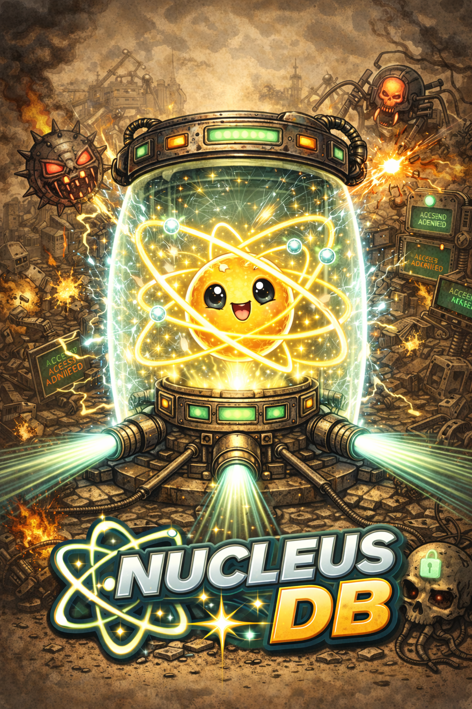

<sub>Our tech stack is ontological: <strong>Hardware — Physics</strong>, <strong>Software — Mathematics</strong></sub>

---

<p align="center">
  
</p>

<p align="center">
  <strong>NucleusDB</strong> — Verifiable Database Engine<br>
  <em>Every write is a cryptographic commitment. Every query comes with a proof. Append-only mode makes deletion mathematically visible.</em>
</p>

[](LICENSE.md)


[Quick Start](#quick-start) · [Discord Bot](#discord-bot) · [SQL Interface](#sql-interface) · [MCP Server](#mcp-server) · [Dashboard](#dashboard) · [Architecture](#architecture) · [Security](#security)

<sub>Part of the <a href="https://www.apoth3osis.io/projects"><strong>MENTAT</strong></a> stack — Layer 1 foundation.</sub>

---

## What Is NucleusDB

NucleusDB is a verifiable database with three properties that are usually split across separate systems:

- a mutable working database with SQL, typed values, blob storage, vector search, and multi-tenant HTTP access
- a proof surface where exact queries come with commitment proofs
- an immutable append-only mode with monotone seal chaining for audit logs and permanent records

The first concrete application shipped on top of it is a Discord recorder that stores every message, edit, and delete event as append-only database entries.

## Quick Start

### Build

```bash
cargo build --release \
  --bin nucleusdb \
  --bin nucleusdb-server \
  --bin nucleusdb-mcp \
  --bin nucleusdb-tui \
  --bin nucleusdb-discord
```

### Create a Database

```bash
./target/release/nucleusdb create --db ./records.ndb --backend merkle
printf 'SET MODE APPEND_ONLY;\n' | ./target/release/nucleusdb sql --db ./records.ndb
```

### Start the Dashboard

```bash
NUCLEUSDB_DB_PATH=./records.ndb ./target/release/nucleusdb dashboard --port 3100
```

### Start the MCP Server

```bash
./target/release/nucleusdb mcp --db ./records.ndb
./target/release/nucleusdb mcp --transport http --host 127.0.0.1 --port 3000 --db ./records.ndb
```

## Discord Bot

`nucleusdb-discord` connects to Discord, records messages into an append-only NucleusDB instance, and exposes verification/search commands.

### Environment

```bash
export NUCLEUSDB_DISCORD_TOKEN=...
export NUCLEUSDB_DISCORD_DB_PATH=./discord_records.ndb
export NUCLEUSDB_DISCORD_CHANNELS=all
export NUCLEUSDB_DISCORD_BATCH_SIZE=10
export NUCLEUSDB_DISCORD_BATCH_TIMEOUT_SECS=5
export NUCLEUSDB_DISCORD_RECORD_BOTS=false
export NUCLEUSDB_DISCORD_RECORD_EDITS=true
export NUCLEUSDB_DISCORD_RECORD_DELETES=true
```

### Run

```bash
./target/release/nucleusdb-discord
```

### Record Schema

- messages: `msg:<channel_id>:<message_id>`
- edits: `edit:<channel_id>:<message_id>:<timestamp>`
- deletes: `del:<channel_id>:<message_id>:<timestamp>`

Each stored message includes author metadata, timestamps, attachment metadata, mention/reaction summaries, and a deterministic `record_seal` hash.

### Slash Commands

- `/status`
- `/verify`
- `/search`
- `/history`
- `/export`
- `/channels`
- `/integrity`

### Recovery Model

The bot batches writes by message count or timeout. On startup it backfills channel history from the last recorded message id, then resumes live recording. The database itself stays in append-only mode, so edits and deletes are logged as new facts rather than overwriting prior state.

## SQL Interface

NucleusDB ships a focused SQL dialect over the verifiable key-value core.

```sql
INSERT INTO data (key, value) VALUES ('temperature', 42);
COMMIT;
SELECT key, value FROM data WHERE key = 'temperature';
SHOW STATUS;
SHOW HISTORY;
VERIFY 'temperature';
EXPORT;
```

Key properties:

- exact keys map deterministically to commitment indices
- typed values preserve JSON, bytes, vectors, and scalar forms
- `COMMIT` is the cryptographic boundary where witnesses, CT heads, and monotone seals advance

## MCP Server

The standalone MCP surface exposes 16 tools:

### Core database tools

- `help`
- `create_database`
- `open_database`
- `execute_sql`
- `query`
- `query_range`
- `verify`
- `status`
- `history`
- `export`
- `checkpoint`

### Discord tools

- `discord_status`
- `discord_search`
- `discord_verify`
- `discord_integrity`
- `discord_export`

Both `stdio` and streamable HTTP transports are supported.

## Dashboard

Sections:

- Overview
- Genesis
- Identity
- Security
- NucleusDB
- Discord

The CRT visual language is retained intentionally: scanlines, grain, rough borders, and terminal color contrast are part of the product identity rather than leftover styling.

## Architecture

```text
Discord Gateway ───────────────┐
                               │
                               ▼
                        nucleusdb-discord
                               │
                               ▼
                    append-only NucleusDB core
                               │
          ┌────────────────────┼────────────────────┐
          ▼                    ▼                    ▼
     nucleusdb CLI        nucleusdb-mcp       nucleusdb-server
          │                    │                    │
          └────────────── dashboard/API/browser ───┘
```

Core subsystems:

- `src/protocol.rs` — commits, proofs, witness signatures, seal chaining
- `src/sql/` — parser and executor
- `src/persistence.rs` — snapshots plus WAL
- `src/blob_store.rs` / `src/vector_index.rs` — content-addressed blobs and embeddings
- `src/mcp/` — agent control surface
- `src/dashboard/` — web dashboard
- `src/discord/` — recorder, recovery, slash commands
- `src/genesis.rs`, `src/identity.rs`, `src/vault.rs` — extracted standalone identity/security modules

A fuller module map is in [Docs/ARCHITECTURE.md](Docs/ARCHITECTURE.md).

## Security

Cryptographic and operational surfaces currently in use:

- SHA-256 content sealing for Discord message records
- certificate-transparency style roots for commit history
- witness signatures on commits
- append-only seal chaining via `immutable.rs`
- AES-GCM encrypted local files for identity/genesis/vault state
- Argon2-based password-derived master keys

Operational guidance:

- keep Discord tokens only in environment files, never source
- run the bot under a dedicated `nucleusdb` system user
- use `deploy/nucleusdb-discord.service`, `deploy/nucleusdb-mcp.service`, and `deploy/nucleusdb-dashboard.service` for restart-on-crash behavior
- use the unified `Dockerfile` and `docker-compose.yml` when you want a single-container deployment

## Testing

Core regression suites retained in this standalone repo:

- `tests/end_to_end.rs`
- `tests/sql_tests.rs`
- `tests/keymap_tests.rs`
- `tests/persistence_compat_tests.rs`
- `tests/cli_smoke_tests.rs`

Run them with:

```bash
cargo test
```

## Repository Layout

- `src/` — Rust implementation
- `dashboard/` — embedded frontend assets
- `deploy/` — systemd units, Docker entrypoint, environment templates
- `lean/NucleusDB/` — formal proof surfaces
- `artifacts/` — shipped trusted setup artifacts

## License

This repository is released under the Apoth3osis License Stack v1. See [LICENSE.md](LICENSE.md) and [licenses/](licenses/).

## Citation

See [CITATION.cff](CITATION.cff).
